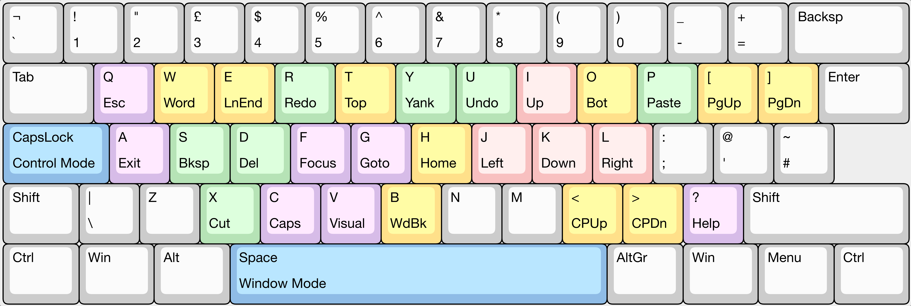
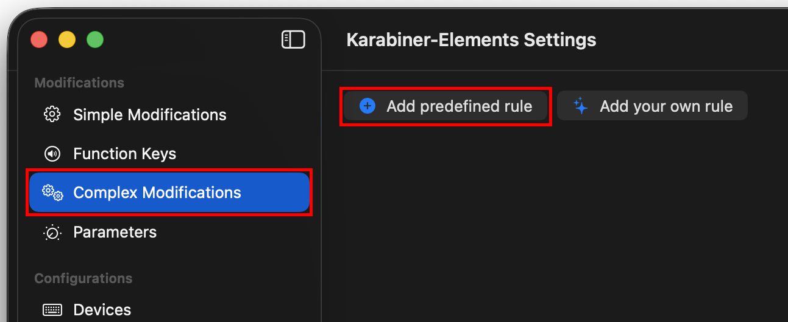
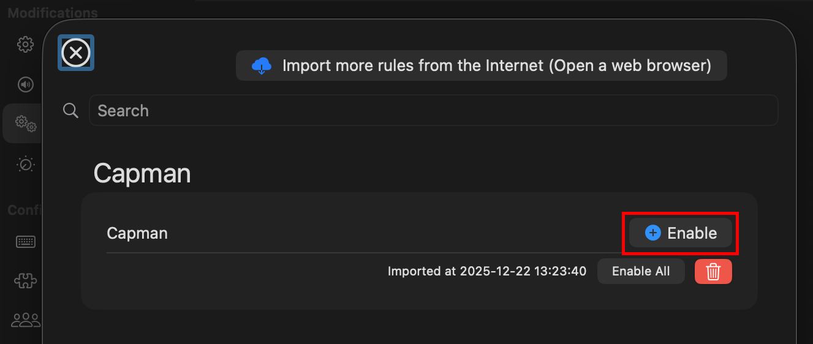

# Capman

Capman turns your Capslock key into a Modifier Key and allows you to control
your Apps and Windows using different modes, such as Control Mode, Visual Mode
and Window Mode.



## Installation (Windows)

1. Clone this repo
2. Install [AutoHotkey](https://www.autohotkey.com/) (AHK)
3. Start `capman.ahk` via command
   `. 'C:/Program Files/Autohotkey/v2/AutoHotkey64_UIA.exe' 'capman/capman.ahk' `
   (replace the paths with your own paths)

## Installation (MacOS)

1. On MacOS: install [Karabiner-Elements](https://karabiner-elements.pqrs.org/)
2. Start 'Karabiner-Elements', give it all required permissions and open the
   'Complex Modifications' tab
3. Download [capman-v0.3.1.json](https://github.com/toscm/capman/releases/download/v0.3.1/capman-v0.3.1.json) and store it as
    `~/.config/karabiner/assets/complex_modifications/capman-v0.3.1.json`

     ```bash
     curl -o ~/.config/karabiner/assets/complex_modifications/capman-v0.3.1.json \
     https://github.com/toscm/capman/releases/download/v0.3.1/capman-v0.3.1.json
     ```
4. In 'Karabiner-Elements', click 'Add predefined rule' and enable 'Capman'

   
   

## Features

### Capslock as Modifier

As soon as you start Capman, the native functionality of your `Capslock` key is
disabled. A single press-and-release of `CapsLock` sends `Escape`. Holding
CapsLock temporarily enables the same bindings as [Control Mode](#control-mode),
so you can navigate without toggling a mode first.

### Control Mode

To enable Control Mode (capman's "Normal Mode"), press `CapsLock + n`. Your
current mode is indicated by a status line at the top right of your primary
monitor (bottom right on MacOS). By default, the status bar is only visible in
special modes, such as [Control Mode](#control-mode), [Visual
Mode](#visual-mode) or [Window Mode](#window-mode). Control Mode enables the
following bindings:

- Text Movement (Vim-style):
  - `h`, `j`, `k`, `l` Move cursor Left/Down/Up/Right
  - `w`, `b`, `e` Word forward / Word back / End of word
  - `0`, `$` Start (Home) / End of Line
  - `gg`, `G` Top/Bottom of file
  - `[`, `]` Page Up/Down
  - `,`, `.` Ctrl Page Up/Down
- Editing:
  - `p`, `x`, `y` Paste/Cut/Copy (Yank)
  - `d`, `s` Delete/Backspace
  - `D` (Shift+d), `Y` (Shift+y) Delete/Yank current line[^dd-yy]
  - `u`, `r` Undo/Redo
- Insert-Mode Entry (Vim-style):
  - `i`, `a` Drop to Insert Mode at cursor
  - `I` (Shift+i), `A` (Shift+a) Drop to Insert Mode at Start/End of Line
  - `o`, `O` (Shift+o) Open new line Below/Above and drop to Insert
- Search:
  - `/` Find in current file (sends `Ctrl+F`)
  - `?` Display available hotkeys
- Window Movement:
  - `n` Next Window[^next-window]
  - `m` Next Pane[^homerow]
  - `f` Find Anything[^homerow]
- Misc:
  - `c` Toggle CapsLock
  - `v` Enter Visual Mode
  - `g` Enter Goto Mode
  - `q`, `CapsLock` Send Escape
- Reserved for Future Use:
  - `z` Maybe zoom

### Visual Mode

For selecting and editing text more efficiently, Capman offers a Visual Mode
inspired by Vim's visual mode. To enter Visual Mode, press `CapsLock & v` or
switch from Control Mode by pressing `v`. In visual mode, the following
keybindings are available:

- Selection movement (Vim-style):
  - `h`, `j`, `k`, `l` Select Left/Down/Up/Right
  - `w`, `b`, `e` Select word forward / back / to end of word
  - `0`, `$` Select to Start / End of Line
- Editing actions auto-exit:
  - `s`, `d`, `x`, `y` Backspace, delete, cut, yank
  - `Enter`, `Space` Insert newline/space
- Mode exits:
  - `a`, `i`, `o`, `v` Exit Visual Mode (drop to Insert Mode)
  - `q`, `CapsLock` Send Escape

### Window Mode

- Enter/Exit Window Mode:
  - `CapsLock + Space` Enter Window Mode
  - `a`, `i` Exit Window Mode (drop to Insert Mode)
  - `Space` Send Space + drop to Insert Mode
  - `Enter` Send Enter + drop to Insert Mode
  - `CapsLock` Send Escape
- Move Windows (Vim-style):
  - `h`, `j`, `k`, `l` Tile Left/Down/Up/Right[^tile-windows]
- Select Windows:
  - `n` Focus next window[^next-window]
- Resize Windows:
  - `f` Maximize active window[^tile-windows]
  - `m` Minimize active window
- Close Windows:
  - `q` Quit current app
  - `w` Close current tab

## Contributing

Want to add a feature or port a binding? See [CONTRIBUTING.md](CONTRIBUTING.md)
for setup instructions, repository layout, and submission guidelines.

[^next-window]: `Next Window` sends `Alt+Tab`, which is unbound by default on
  MacOS. To enable `AltTab` functionality on MacOS as well, please install.
  [alt-tab-macos](https://github.com/lwouis/alt-tab-macos).
[^homerow]: `CapsLock+m` (Next Pane) and `CapsLock+f` (Find Anything) send the
  default shortcuts for triggering [Homerow](https://homerow.app/). I.e., they
  will only work, if you have Homerow installed and running.
[^tile-windows]: On macOS, window tiling and maximizing is achieved by sending
  the default [Rectangle](https://rectangleapp.com/) shortcuts. I.e., these
  bindings will only work, if you have Rectangle installed and running.
[^dd-yy]: Vim's `dd` / `yy` chords are not detected; capman binds the line-wise
  operations to `D` (Shift+d) and `Y` (Shift+y) instead.
