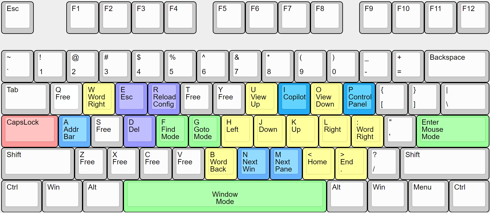

# Capman

Capman turns your Capslock key into a Modifier Key and allows you to control
your Apps and Windows using different modes, such as Control Mode, Visual Mode
and Window Mode.



## Installation (Windows)

1. Clone this repo
2. Install [AutoHotkey](https://www.autohotkey.com/) (AHK)
3. Start `capman.ahk` via command
   `. 'C:/Program Files/Autohotkey/v2/AutoHotkey64_UIA.exe' 'c:/Users/tobi/capman/capman.ahk' `
   (replace the paths with your own paths)

## Installation (MacOS)

1. On MacOS: install [Karabiner-Elements](https://karabiner-elements.pqrs.org/)
2. Start 'Karabiner-Elements', give it all required permissions and open the
   'Complex Modifications' tab
3. Download [capman-v0.2.0.json](https://github.com/toscm/capman/releases/download/v0.2.0/capman-v0.2.0.json) and store it as
    `~/.config/karabiner/assets/complex_modifications/capman-v0.2.0.json`

     ```bash
     curl -o ~/.config/karabiner/assets/complex_modifications/capman-v0.2.0.json \
     https://github.com/toscm/capman/releases/download/v0.2.0/capman-v0.2.0.json
     ```
4. In 'Karabiner-Elements', click 'Add predefined rule' and enable 'Capman'

   
   

## Features

### Capslock as Modifier

As soon as you start Capman, the native functionality of your `Capslock` key is
disabled and the key behaves like an additional modifier. Holding CapsLock
temporarily enables the same bindings as [Control Mode](#control-mode), so you
can navigate without toggling a mode first.

### Control Mode

To enable Control Mode, press `CapsLock` once without any other keys. Your
current mode is indicated by a status line at the top right of your primary
monitor (bottom right on MacOS). By default, the status bar is only visible in
special modes, such as [Control Mode](#control-mode), [Visual
Mode](#visual-mode) or [Window Mode](#window-mode). Control Mode enables the
following bindings:

- Text Movement:
  - `i`, `j`, `k`, `l` Move cursor
  - `w`, `b` Jump by word
  - `e`, `h` Go to End/Start (Home) of Line
  - `t`, `o` Go to Top/Bottom of Document
  - `[`, `]` Page Up/Down
  - `,`, `.` Ctrl Page Up/Down
- Editing:
  - `p`, `x`, `y` Paste/Cut/Copy (Yank)
  - `d`, `s` Delete/Backspace
  - `u`, `r` Undo/Redo
- Window Movement:
  - `n` Next Window[^next-window]
  - `m` Next Pane[^homerow]
  - `f` Find Anything[^homerow]
- Misc:
  - `c` Toggle CapsLock
  - `/` Display available hotkeys
  - `a` Exit Control Mode
  - `v` Enter Visual Mode
  - `q` Escape
  - `CapsLock` Toggle Control Mode
- Reserved for Future Use:
  - `z` Maybe zoom
  - `g` Maybe go to anything

### Visual Mode

For selecting and editing text more efficiently, Capman offers a Visual Mode
inspired by Vim's visual mode. To enter Visual Mode, press `CapsLock & v` or
switch from Control Mode by pressing `v`. In visual mode, the following
keybindings are available:

- Selection movement:
  - `i`, `j`, `k`, `l` Select by character
  - `w`, `b` Select word forward/back
  - `e`, `h` Select to End/Home
- Editing actions auto-exit:
  - `s`, `d`, `x`, `y` Backspace, delete, cut, yank
  - `Enter`, `Space` Insert newline/space
- Mode exits:
  - `CapsLock`, `a`, `o`, `v` Exit Visual Mode
  - `q` Send Escape

### Window Mode

- Enter/Exit Window Mode:
  - `CapsLock + Space` Enter Window Mode
  - `CapsLock`, `a`, `Space` Exit Window Mode
- Move Windows:
  - `i`, `j`, `k`, `l` Tile Up/Left/Down/Right[^tile-windows]
- Select Windows:
  - `n` Focus next window[^next-window]
- Resize Windows:
  - `Enter`, `f` Maximize active window[^tile-windows]
  - `m` Minimize active window
- Close Windows:
  - `q` Quit current app
  - `w` Close current tab

## Contributing

Want to add a feature or port a binding? See [CONTRIBUTING.md](CONTRIBUTING.md)
for setup instructions, repository layout, and submission guidelines.

[^next-window]: `Next Window` sends `Alt+Tab`, which is unbound by default on
  MacOS. To enable `AltTab` functionality on MacOS as well, please install.
  [alt-tab-macos](https://github.com/lwouis/alt-tab-macos).
[^homerow]: `CapsLock+m` (Next Pane) and `CapsLock+f` (Find Anything) send the
  default shortcuts for triggering [Homerow](https://homerow.app/). I.e., they
  will only work, if you have Homerow installed and running.
[^tile-windows]: On macOS, window tiling and maximizing is achieved by sending
  the default [Rectangle](https://rectangleapp.com/) shortcuts. I.e., these
  bindings will only work, if you have Rectangle installed and running.
