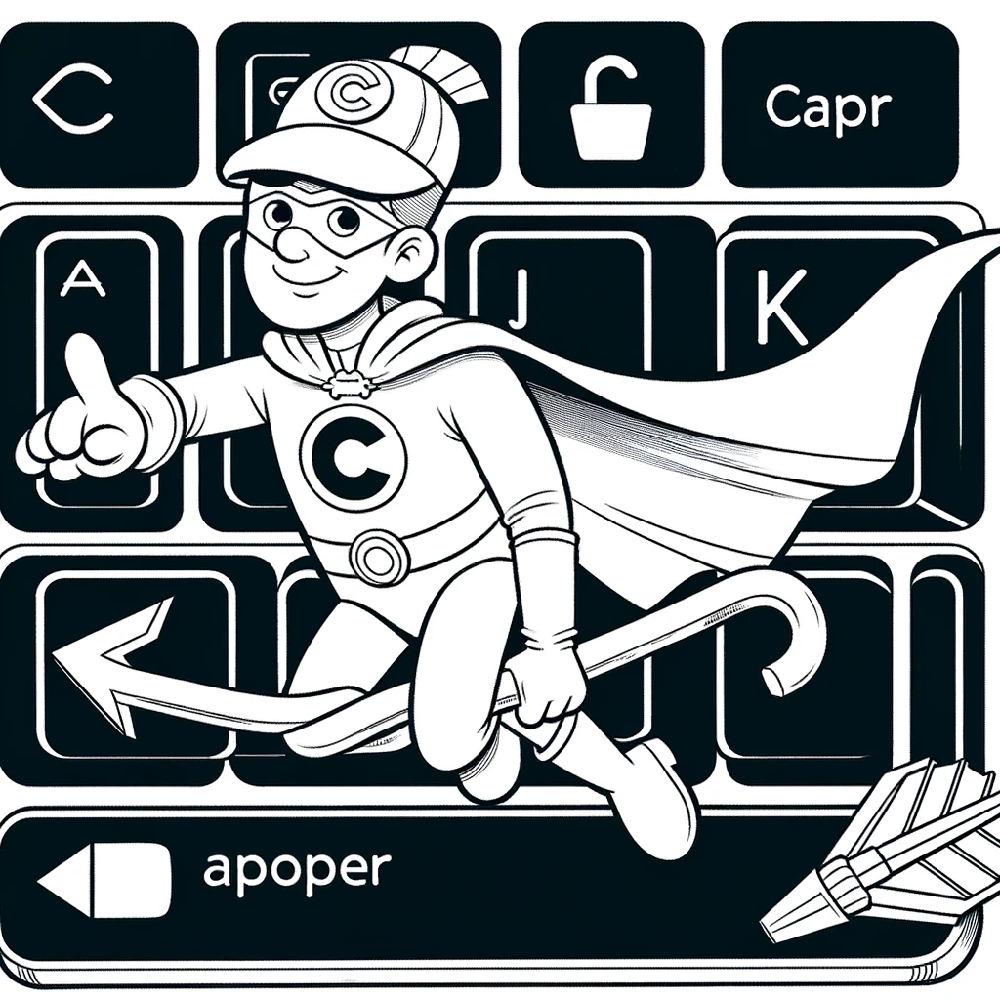
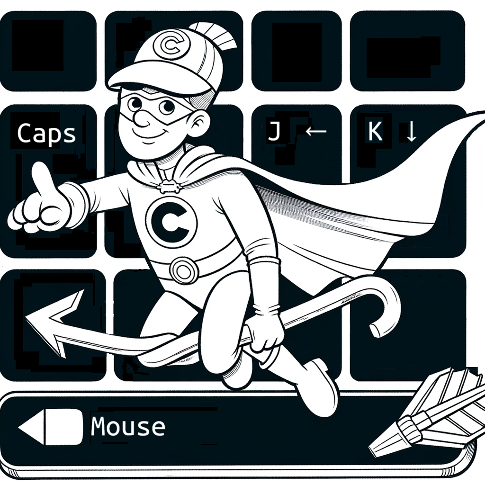

This file describes where and how the used images were obtained.

# capman_dalle.png

Created 2023-11-28 using [Coloring Book Hero](https://chat.openai.com/g/g-DerYxX7rA-coloring-book-hero) Plugin from ChatGPT.

## Prompt

I want a comic book about capman. Capman is a superhero, that flies on a huge capslock key. He has a big C on his suit and an arrow in one hand (like the arrow from a computer mouse) and a pipe in the other hand. His cape looks like a window or window frame. The storyline should be, that often times computers dont want to do, what the user wants them to do, but then capman comes to rescue.

## Output

Creating a coloring book page featuring "Capman" sounds like a fun and imaginative idea! Since coloring books usually focus on single scenes rather than entire storylines, I'll design a page that encapsulates the essence of Capman and his adventures.

For this page, I'll depict Capman flying on his huge caps lock key, wearing his suit with a big 'C', and holding an arrow in one hand and a pipe in the other. His cape will resemble a window frame, symbolizing his connection to the digital world. The scene will be simple and whimsical, capturing a moment where Capman is ready to help with computer troubles, making it both engaging and easy for children to color.

Let's create this image!

Here is the coloring book page featuring Capman, the computer-savvy superhero. He's ready for action on his caps lock key, equipped with an arrow and a pipe, and his cape resembling a window frame. This page should be a delightful and creative coloring activity for children. Enjoy bringing Capman to life with colors!

# capman_edited.png

Created by modifying [capman_dalle.png](capman_dalle.png) in Paint.

